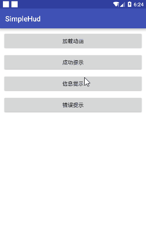

#SimpleHud
- A simple loading dialog for android

##Screen Shot

## Usage

### Step 1

### Gradle

	dependencies {
	    compile 'com.github.weiteng4droid:hudLibrary:1.0.4'
	}

If it doesn't work, please send me a email, weiteng4droid@163.com

### Step 2
show a simple dialog in activity

* loading

	SimpleHUD.showLoadingMessage(this, "loading");
	
* info

	SimpleHUD.showInfoMessage(this, "删除成功");

* success

	SimpleHUD.showSuccessMessage(this, "上传成功");
	
* error

	SimpleHUD.showErrorMessage(this, "数据异常，具体原因是什么我也不知道，哈哈")